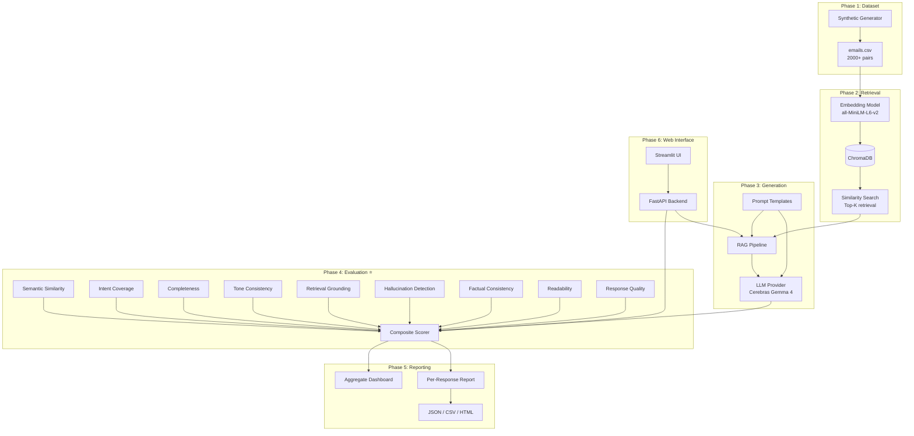

# AI Email Suggested Response System

An end-to-end AI system that generates and evaluates email replies using Retrieval-Augmented Generation (RAG) grounded in historical email data. The system features a comprehensive multi-dimensional evaluation framework to score the quality, intent coverage, tone, and factuality of the generated responses.

## Objectives
1. Suggest context-aware email replies grounded in historical examples.
2. Avoid hallucinations through retrieval augmentation.
3. Provide a robust, multi-dimensional evaluation framework (not just BLEU/ROUGE) to accurately assess response quality.
4. Produce detailed interpretable reports explaining score deductions.

## Architecture



## System Workflow
1. **Dataset Generation**: Creates a synthetic dataset of 2,000+ email/response pairs across 14 categories.
2. **Indexing**: Embeds the emails using `all-MiniLM-L6-v2` and stores them in ChromaDB.
3. **Retrieval**: For a new incoming email, retrieves the top-K similar historical emails based on semantic similarity and optional metadata filters.
4. **Generation**: Uses the Cerebras OpenAI-compatible API (Gemma 4 model) to generate a response, inserting the retrieved historical examples into the prompt for grounding.
5. **Evaluation**: Evaluates the generated response using a composite evaluation framework consisting of 9 different metrics.
6. **Reporting**: Generates JSON, CSV, and HTML reports for individual responses, and an aggregate dashboard.

## Dataset
The dataset is synthetically generated using the Cerebras API (Gemma 4). It contains diverse examples across 14 categories (Customer Support, HR, Sales, etc.), 9 styles (formal, angry, missing_info, etc.), and various sender types.
Schema: `id, category, sender_type, email, reply, urgency, sentiment, style, word_count_email, word_count_reply`

## Generation Pipeline
The Generation Pipeline relies on RAG. It takes the incoming email, searches for similar examples in the vector store, formats them into a carefully engineered prompt with instructions on tone and grounding, and calls the LLM.

## Evaluation Methodology & Metrics
We avoid relying purely on n-gram overlap metrics (like BLEU or ROUGE) because they do not correlate well with actual semantic quality or correctness. Instead, we use a composite approach:

- **Semantic Similarity (20%)**: Combines Sentence-BERT cosine similarity and BERTScore.
- **Intent Coverage (25%)**: LLM extracts intents from the source email and verifies they are covered in the reply.
- **Completeness (20%)**: LLM verifies that every question asked is answered.
- **Retrieval Grounding (15%)**: Ensures the generated response aligns with the retrieved historical examples.
- **Tone Consistency (10%)**: LLM compares the tone of the generated reply with the reference.
- **Hallucination Detection (10%)**: LLM penalizes responses that invent facts, dates, or promises not in the context.
- **Readability (Modifier)**: Flesch Reading Ease and length checks.
- **Business Rules (Penalty)**: Verifies greetings, sign-offs, and appropriate language.

## Installation

1. Create a virtual environment and install dependencies:
```bash
python -m venv venv
venv\Scripts\activate  # On Windows
pip install -r requirements.txt
```

2. Set up environment variables:
```bash
cp .env.example .env
# Edit .env and add your Cerebras API key
```

## Running the Project

### 1. Generate Dataset
```bash
python -m dataset.synthetic_generation --count 2000
```

### 2. Run Evaluation Experiment
Runs the full pipeline over the dataset and generates reports.
```bash
python -m experiments.run_evaluation --sample-size 50
```

### 3. Run Web Interface
Launch the Streamlit app.
```bash
streamlit run app/streamlit_app.py
```

### 4. Run API Backend
Launch the FastAPI backend.
```bash
uvicorn app.api:app --reload --port 8000
```

### 5. Run Ablation Studies
```bash
python -m experiments.ablation_study --experiment all
```

## Performance & Validation
The `metric_validation.py` experiment validates that our metrics properly penalize deliberately degraded responses (e.g., hallucinations, partial answers, tone mismatch) while rewarding good paraphrases. A correlation analysis demonstrates the divergence between lexical and semantic scores, proving the necessity of semantic evaluation.

## Limitations & Future Improvements
- **LLM Rate Limits**: Generating large datasets and evaluating them with LLM-as-a-judge is API intensive.
- **Retrieval Upgrade**: Upgrading the embedding model to `BGE-Large` or adding a reranking step (like Cohere Rerank) could improve RAG performance.
- **Human Evaluation UI**: The current system outputs to CSV for manual review, but an integrated annotation UI could streamline human-in-the-loop evaluation.

## License
MIT License
